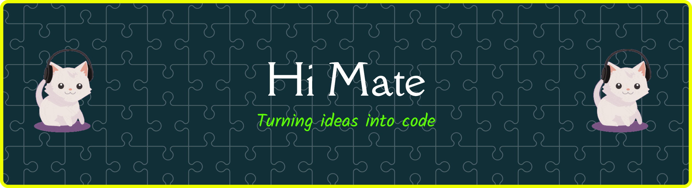

<h2 align="center">Hi I'm Nadhif  A student from Indonesia building cool things with code.</h2>

 

#### Tech stack

#### Connect With Me

 
 

##### Watch my contribution graph play games

 

<picture>
  <source media="(prefers-color-scheme: dark)" srcset="https://raw.githubusercontent.com/ocill1/ocill1/output/pacman-contribution-graph-dark.svg">
  <source media="(prefers-color-scheme: light)" srcset="https://raw.githubusercontent.com/ocill1/ocill1/output/pacman-contribution-graph.svg">
  
</picture>
